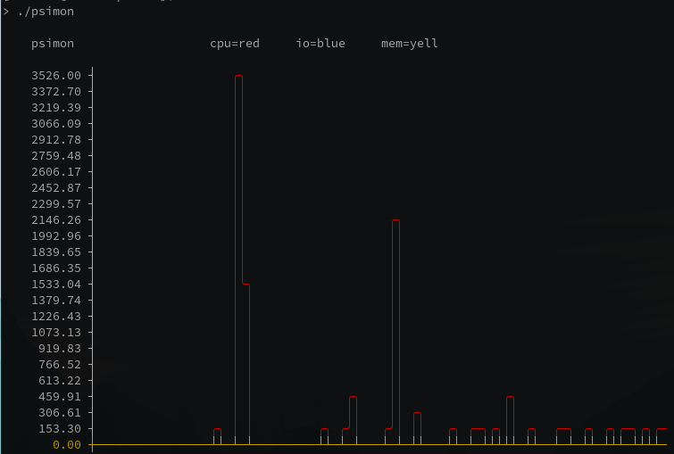

# psimon
monitoring utility for pressure stall information

# What is Pressure Stall Information?

>The psi feature identifies and quantifies the disruptions caused by resource contention   and the time impact it has on complex workloads or even entire systems.


## Can't We Already Get Interactive System Load Information?

PSI reports the percentage of wallclock time in which tasks are waiting for a CPU to run on. 
This is more granular and indicitave of system health than system load [3].

## Runtime Requirements

Kernel must support psi (must be built with `CONFIG_PSI=y`), which requires at least linux 4.20
If your kernel is compiled with `CONFIG_PSI_DEFAULT_DISABLED`, you will need to pass a command line flag to pass `psi=1` to the kernel on boot.


## Build Requirements
```
git gcc make
```


## Build Instructions

```
git clone --recurse-submodules https://github.com/holmanb/psimon.git
cd psimon
make
make psimon
```

## Usage
currently `psimon` doesn't require any arguments and shows PSI counter values in realtime




## Future Work
- add cgroup support
- parse "full" pressure counters for io && memory
- add flags for selecting memory, io, or cpu
- randomized file names in /tmp
- various TODO cleanup items in codebase
- add units
- add averages
- fix y axis color issue (see )


## Pressure Stall Information References

[1] Kernel Docs at [kernel.org](https://www.kernel.org/doc/html/latest/accounting/psi.html)

[2] Kernel Source [Docs](https://git.kernel.org/pub/scm/linux/kernel/git/torvalds/linux.git/tree/Documentation/accounting/psi.rst)

[3] Description At [lwn.net](https://lwn.net/ml/cgroups/20180712172942.10094-1-hannes@cmpxchg.org/)

[4] Facebook Helped Develop [PSI](https://facebookmicrosites.github.io/psi/docs/overview) and includes their use cases
